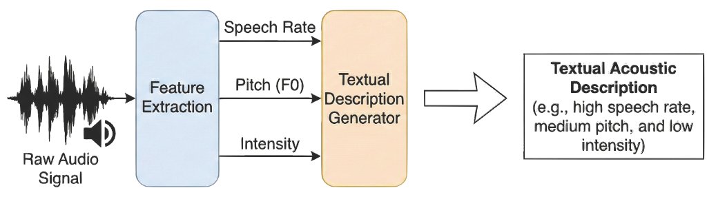
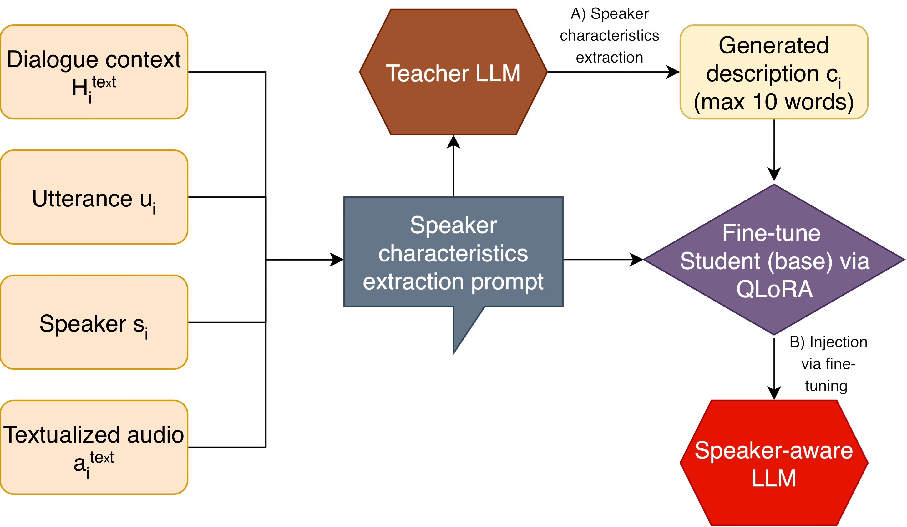
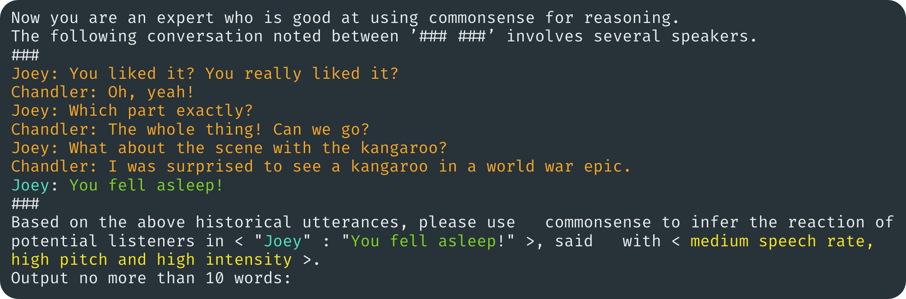
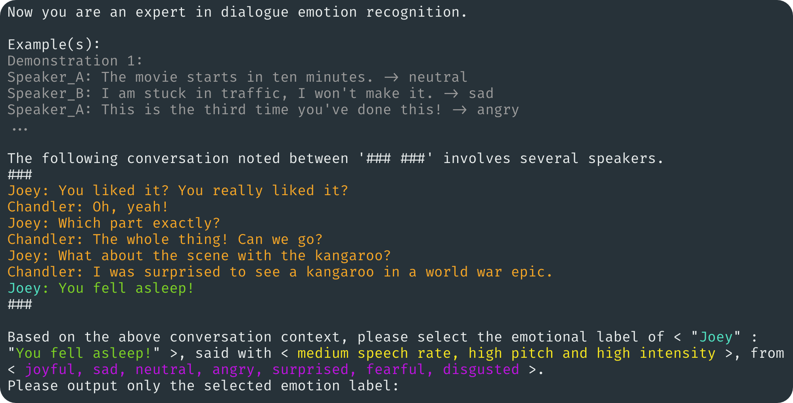
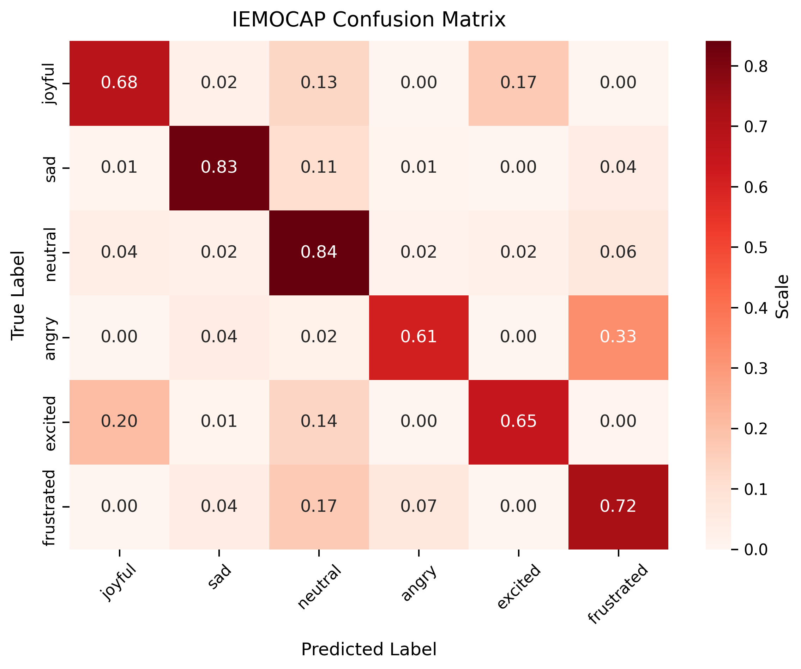
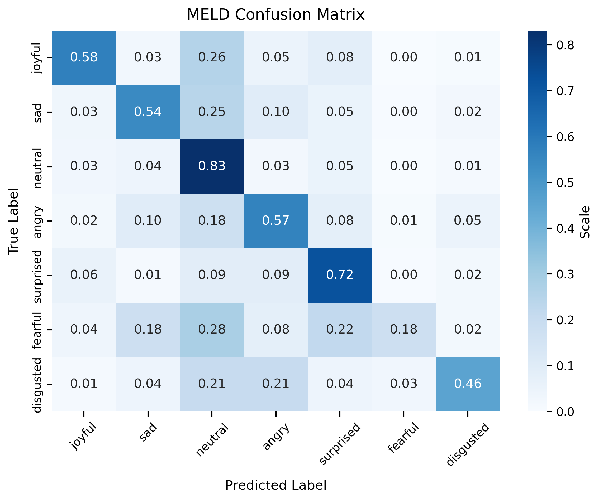

# Multimodal RAG-based Emotion Recognition in Conversation

A multimodal, retrieval-augmented approach to Emotion Recognition in Conversation (ERC) using LLaMA-3.1-8B-Instruct, evaluated on the MELD and IEMOCAP benchmark datasets. 

This repository contains the code and methodology from the master's thesis **"Emotion Detection and Analysis in Conversational AI."**

## Motivation
Conversational AI is shifting from simple, command-based interactions (e.g., standard voice assistants) to fluid, highly personal dialogues. To achieve natural human-computer interaction, systems must understand the underlying emotions of the user. 

Emotion Recognition in Conversation (ERC) is the task of identifying the predominant emotion of an utterance within a multi-speaker conversation. This task presents several core challenges:
* **Context Dependence:** Meaning heavily relies on dialogue history (e.g., sarcasm).
* **Multimodality:** Text alone is ambiguous; acoustic cues (tone, speech rate) are essential.
* **Subjectivity & Emotion Overlap:** Emotions are fuzzy, and states like *Happy* and *Excited* often occur simultaneously.

To address these challenges, this framework leverages Large Language Models (LLMs) for deep contextual reasoning, integrates acoustic features textually, and uses a two-phase training approach to mitigate subjective ambiguity by making the model "speaker-aware."

---

## Methodology & Architecture

The system combines three key innovations to bridge the gap between text-only LLMs and multimodal ERC:

### 1. Multimodal Audio-to-Text Abstraction
Raw audio signals are rich in emotional cues but require heavy, memory-intensive encoders to process. Instead, this framework extracts three core acoustic features—**Speech Rate, Pitch ($F_0$), and Intensity**—and discretizes them into categorical text descriptions.



Thresholds for these features are computed using dataset-specific quantiles (e.g., 0.3 and 0.7) to categorize the audio into *low, medium,* or *high* brackets.

| Feature | Label | Threshold condition |
|---|---|---|
| **Speech rate** | low speech rate | $v_{\text{rate}}<\theta_{\text{rate}}^{\text{low}}$ |
| | medium speech rate | $\theta_{\text{rate}}^{\text{low}}\leq v_{\text{rate}}<\theta_{\text{rate}}^{\text{high}}$ |
| | high speech rate | $v_{\text{rate}}\geq\theta_{\text{rate}}^{\text{high}}$ |
| **Pitch** | low pitch | $v_{\text{pitch}}<\theta_{\text{pitch}}^{\text{low}}$ |
| | medium pitch | $\theta_{\text{pitch}}^{\text{low}}\leq v_{\text{pitch}}<\theta_{\text{pitch}}^{\text{high}}$ |
| | high pitch | $v_{\text{pitch}}\geq\theta_{\text{pitch}}^{\text{high}}$ |
| **Intensity** | low intensity | $v_{\text{intensity}}<\theta_{\text{intensity}}^{\text{low}}$ |
| | medium intensity | $\theta_{\text{intensity}}^{\text{low}}\leq v_{\text{intensity}}<\theta_{\text{intensity}}^{\text{high}}$ |
| | high intensity | $v_{\text{intensity}}\geq\theta_{\text{intensity}}^{\text{high}}$ |

This results in a short textual descriptor (e.g., *"high speech rate, medium pitch, and low intensity"*) that can be fed directly into the text prompt of an LLM.

### 2. Two-Phase Fine-Tuning (QLoRA)
To build a model that truly understands the nuances of a conversation, fine-tuning is split into two distinct phases using parameter-efficient QLoRA.

**Phase 1: Speaker Awareness**
Before predicting an emotion, the base LLM (Llama-3.1-8B-Instruct) is trained to understand the speaker's state. Using a teacher-student distillation approach, an advanced teacher LLM (Gemini 2.5 Flash) generates common-sense speaker characteristics based on the dialogue context and acoustic features. The base model is then fine-tuned on these prompt-output pairs.



*Example Phase 1 Prompt:*


**Phase 2: Emotion Recognition**
The speaker-aware model from Phase 1 is then fine-tuned specifically for the ERC classification task. It is trained to map the enriched context to a ground-truth emotion label. 

### 3. Retrieval-Augmented In-Context Learning (RAG)
To move the model from zero-shot guessing to few-shot reasoning, the framework retrieves dynamic, semantically similar conversational flows from the training set. At inference time, a ChromaDB vector store is queried to fetch the top-$n$ most similar historical interactions. These are inserted into the Phase 2 prompt as **Demonstrations**.

*Example Phase 2 Prompt (with RAG Demonstrations):*


---

## Experimental Evaluation

### Datasets
The framework was evaluated on two widely used benchmark datasets with vastly different characteristics:
* **IEMOCAP:** Clean, studio-quality, dyadic (two-person) interactions with long utterances.
* **MELD:** Noisy, multi-party interactions extracted from the TV show *Friends*, characterized by short utterances and high class imbalance.

| Dataset | Conversations | Utterances | Classes | Type | Avg. Utt. Len. | Avg. Conv. Len. |
|---|---|---|---|---|---|---|
| IEMOCAP | 151 | 7433 | 6 | Two-person | 15.8 | 49.2 |
| MELD | 1432 | 13708 | 7 | Multi-party | 8.0 | 9.6 |

### Training Setup & Hyperparameters

| Parameter | Phase 1 | Phase 2 |
|---|---|---|
| **Base Model** | Llama-3.1-8B-Instruct | Llama-3.1-8B-Instruct |
| **LoRA Rank ($r$)** | 16 | 16 |
| **LoRA Alpha ($\alpha$)** | 32 | 32 |
| **Max Seq. Length** | 1536 | 1536 |
| **Batch Size** | 16 | 16 |
| **Eval. Frequency** | Every 150 steps | Every 150 steps |
| **Adapter** | None | From Phase 1 |
| **Learning Rate** | 2e-4 | 5e-5 |
| **Early Stop Patience** | 3 | 2 |

### Main Results & SOTA Comparison
The model achieves highly competitive results, generalizing exceptionally well across both clean and noisy datasets. Evaluation uses the **Weighted F1-Score** to account for class imbalances.

| Model | MELD | IEMOCAP | Average |
|---|---|---|---|
| DialogueLLM (2024) | **71.90** | 69.93 | 70.92 |
| MERC-PLTAF (2025) | 67.73 | **74.80** | 71.27 |
| GS-MCC (2024) | 69.00 | 73.90 | 71.45 |
| PRC-Emo (2025) | 70.44 | 71.95 | 71.20 |
| InstructERC (2024) | 69.15 | 71.39 | 70.27 |
| LaERC-S (2025) | 69.27 | 72.40 | 70.84 |
| **Ours** | 69.74 | 73.84 | **71.79** |

### Ablation Studies
Ablation testing reveals that fine-tuning is the primary driver of performance (a ~15% jump over the base model on MELD). For clean data (IEMOCAP), utilizing the full prompt with Audio and RAG is strictly optimal. Conversely, for noisy data (MELD), retrieving audio and demonstrations occasionally introduces noise, making a simpler text-only baseline marginally better in specific configurations.

| Configuration | IEMOCAP | MELD |
|---|---|---|
| **1. Ours (Standard)** | **73.84** | 69.74 |
| 2. w/o Audio | 71.91 (↓1.93) | 68.96 (↓0.78) |
| 3. w/o RAG (Demonstrations)| 71.67 (↓2.17) | 69.98 (**↑0.24**) |
| 4. w/o Audio & RAG | 69.61 (↓4.23) | **70.08** (**↑0.34**) |
| *5. Base Model (No Fine-Tuning)* | 65.00 (↓8.8) | 55.00 (↓14.7) |

### Error Analysis

**IEMOCAP Confusion Matrix:**
While recall is high across most classes, the model exhibits expected confusion between semantically adjacent emotions. For instance, 33% of *Angry* samples are misclassified as *Frustrated*, and 20% of *Excited* samples are confused with *Joyful*.



**MELD Confusion Matrix:**
MELD's extreme class imbalance (47% of the data is *Neutral*) introduces a strong bias. Rare emotions suffer significantly, with *Fearful* (only ~2% of the data) showing a steep drop in recall as the model defaults to *Neutral*.



---

## Directory Structure

```
mm-rag-erc/
├── data/
│   ├── benchmark/          # Processed benchmark CSVs (MELD, IEMOCAP)
│   ├── processed/          # Optional: intermediate processed datasets
│   └── training/
│       ├── stage1/         # Phase 1 JSONL training files
│       └── stage2/         # Phase 2 JSONL training files
├── artifacts/
│   ├── finetuning/         # LoRA adapter checkpoints
│   ├── eval/               # Evaluation results (stage1, stage2)
│   ├── speaker_chars/      # Phase 1 speaker-characteristic JSON files
│   └── vectorstores/
│       ├── db/             # ChromaDB vector store directories
│       ├── caches/         # Pre-computed similarity cache JSON files
│       └── utterance_index_mapping.json
├── src/
│   ├── config/             # Paths and constants
│   ├── data_processing/    # MELD and IEMOCAP data preparation
│   ├── helper/             # Prompts, utilities, dataset builder
│   ├── vectorstore/        # Vector store creation and caching
│   ├── training_data_creation/  # Phase 1 and Phase 2 dataset assembly
│   └── training/           # Fine-tuning and evaluation scripts
└── requirements.txt
```

---

## Prerequisites

- Python 3.10+
- CUDA-capable GPU (required for training and evaluation)
- [ffmpeg](https://ffmpeg.org/) on `PATH` (required for MELD MP4 → WAV conversion)
- [Ollama](https://ollama.com/) running locally (optional; required only if using `model_id=0` for Phase 1 annotation)

Install Python dependencies:

```bash
pip install -r requirements.txt
```

---

## Configuration

Edit `src/config/paths.py` and set the two raw-data paths at the top of the file:

```python
MELD_RAW_DATA_DIR    = "/path/to/MELD.Raw"
IEMOCAP_RAW_DATA_DIR = "/path/to/IEMOCAP_full_release"
```

All other paths are derived automatically from the project root.

---

## Pipeline

Run the steps below **in order**. All scripts are run as Python modules from the project root.

### Step 1 — Initialise benchmark CSVs

Parse the raw dataset files into standardised CSVs:

```bash
python -m src.data_processing.meld.init_meld_dataset
python -m src.data_processing.iemocap.init_iemocap_dataset
```

Output: `data/benchmark/meld/meld_erc_init.csv` and `data/benchmark/iemocap/iemocap_erc_init.csv`.

### Step 2 — Convert MELD audio (MP4 → WAV)

```bash
python -m src.data_processing.meld.convert_meld_mp4_to_wav
```

Requires `ffmpeg`. Writes WAV files to `<MELD_RAW_DATA_DIR>/audio/`.

### Step 3 — Extract acoustic features

```bash
python -m src.data_processing.meld.add_audio_features_meld
python -m src.data_processing.iemocap.add_audio_features_iemocap
```

Adds pitch, intensity, articulation rate, and HNR columns.  Output: `*_erc_with_audio.csv`.

### Step 4 — Categorise acoustic features

```bash
python -m src.data_processing.meld.extend_meld_categories
python -m src.data_processing.iemocap.extend_iemocap_categories
```

Adds `pitch_level`, `intensity_level`, `rate_level` (low/medium/high) and a unified `mapped_emotion` column.  Output: `*_erc_final.csv`.

### Step 5 — Build vector stores

```bash
python -m src.vectorstore.generators.run_vectorstore_generators
```

Creates single, flow, and hybrid ChromaDB collections under `artifacts/vectorstores/db/`.

### Step 6 — Create utterance-index metadata

```bash
python -m src.vectorstore.caching.create_idx_to_metadata
```

Writes `artifacts/vectorstores/utterance_index_mapping.json`.

### Step 7 — Cache similarity lookups

```bash
python -m src.vectorstore.caching.cache_similar_utterances --top_n 10
```

Pre-computes top-10 similar utterances for every entry in both datasets.

### Step 8 — Generate Phase 1 training data

First, generate speaker-characteristic annotations:

```bash
python -m src.training_data_creation.phase1.generate_speaker_characteristics
```

Then assemble the JSONL training files:

```bash
python src/training_data_creation/phase1/build_dataset.py
```

Output: `data/training/stage1/MELD/` and `data/training/stage1/IEMOCAP/`.

### Step 9 — Phase 1 fine-tuning

```bash
python -m src.training.phase1_finetune \
    --dataset both --epochs 4 --lora_r 16 --use_qlora true
```

The best checkpoint is saved to `artifacts/finetuning/STAGE1-DEFAULT-r16/`.

### Step 10 — Generate Phase 2 training data

```bash
python src/training_data_creation/phase2/build_dataset.py
```

Output: `data/training/stage2/MELD/` and `data/training/stage2/IEMOCAP/`.

### Step 11 — Phase 2 fine-tuning

```bash
python -m src.training.phase2_finetune \
    --stage1_adapter_path artifacts/finetuning/STAGE1-DEFAULT-r16/COMBINED/QLORA/final_checkpoint \
    --dataset iemocap --epochs 4 --lora_r 16 --use_qlora true
```

### Step 12 — Evaluation

**Phase 2 evaluation (single adapter):**

```bash
python -m src.training.stage2_eval_parallel \
    --adapter_path <path/to/checkpoint> \
    --dataset iemocap --split test
```

**Phase 2 evaluation (all checkpoints under a directory):**

```bash
python -m src.training.run_full_stage2_evaluations \
    --finetuning_root artifacts/finetuning/STAGE1_2-DEFAULT-r16 \
    --dataset both --split test
```

**Phase 1 evaluation:**

```bash
python -m src.training.stage1_eval_parallel \
    --adapter_path <path/to/checkpoint> \
    --split dev --dataset both
```
